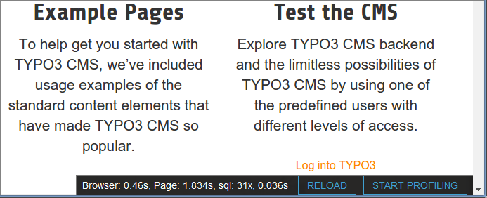

**************************
TYPO3 performance analysis
**************************

``nr_perfanalysis`` is a TYPO3 extension that collects timing and count
data about the SQL queries sent to the database.
It then displays the summary in the bottom right of the frontend pages:

==============
Custom numbers
==============
Your own extensions can collect statistical data, too.

Start an event::

    $statCounter = Netresearch\NrPerfanalysis\Counter::get();
    $statCounter->start('REST', 'PUT');

Finish it off::

    $statCounter = Netresearch\NrPerfanalysis\Counter::get();
    $statCounter->finish('REST', 'PUT');

Now you logged a "PUT" event in the "REST" group, and the REST group
will show up in the statistics on the bottom right.

============
Dependencies
============
- TYPO3 6.2+
- PHP 5.4+ for page generation statistics
